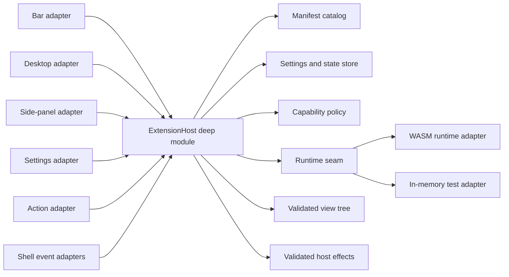

# Shilpo Extension Architecture

Status: accepted architecture. Phase 1's contract, catalog primitives, policy host, in-memory runtime, schemas, and
namespaced shell references are implemented. The WASM runtime, development CLI, shell-surface adapters, and installer
remain planned.

## Decision

Shilpo extensions will use:

- a versioned TOML manifest for static metadata, contributions, settings, and permissions;
- WebAssembly Component Model modules for optional extension logic;
- a small, declarative view tree rendered by Shilpo with GPUI and `shilpo-ui`;
- host-owned lifecycle, state, scheduling, persistence, diagnostics, and capability enforcement;
- path-based development extensions and packaged end-user extensions using the same runtime.

An extension never receives a GPUI `App`, `Window`, entity, shell runtime handle, service implementation, or
unrestricted operating-system access.

This deliberately combines two proven ideas:

- Zed's versioned manifest, WASM isolation, capability grants, development override, and separation of installed files
  from extension-owned data.
- Noctalia's manifest-declared shell contribution points, instance-aware widgets, shared background logic, settings
  integration, local development sources, and extension catalog.

## Goals

The system must support:

- bar widgets;
- desktop widgets such as clocks, notes, and monitors;
- side-panel pages and control-center entries;
- extension-owned settings pages;
- launcher providers and shell actions;
- background behavior reacting to typed shell events;
- privileged effects such as changing wallpaper only after an explicit capability grant;
- development, installation, update, disable, recovery, and uninstall workflows.

The system must also keep the shell usable when an extension is invalid, slow, incompatible, or crashes.

## Non-goals

The first version will not support:

- native Rust dynamic libraries;
- direct construction of arbitrary GPUI elements;
- direct access to `ShellRuntime` or Shilpo service implementations;
- extensions replacing core surfaces such as the lock screen or notification daemon;
- extension-to-extension dependencies;
- arbitrary code execution without a narrow manifest declaration and user grant;
- marketplace auto-publishing before package verification and update rollback exist.

## Why WASM and declarative UI

| Option                             | Benefit                                                                                      | Problem                                                                           | Decision                              |
|------------------------------------|----------------------------------------------------------------------------------------------|-----------------------------------------------------------------------------------|---------------------------------------|
| Rust dynamic library               | Direct GPUI access and maximum flexibility                                                   | No stable Rust ABI, no isolation, and an extension can crash or corrupt the shell | Reject                                |
| Extension process over JSON-RPC    | Strong process isolation and language independence                                           | Process lifecycle and render round trips are expensive for many small widgets     | Reserve for future external providers |
| Embedded scripting language        | Fast iteration and simple packaging                                                          | Adds a language/runtime and weakens compile-time contracts                        | Reject for version 1                  |
| WASM component with declarative UI | Stable versioned contract, resource limits, portable packages, and host-controlled rendering | Requires a constrained view protocol                                              | Select                                |

The constrained view protocol is intentional. The shell owns layout safety, theme tokens, accessibility, focus behavior,
and rendering performance. Extensions supply state and intent, not raw drawing access.

## Module shape



### `shilpo-ext`

`crates/ext` becomes the stable contract shared with extension authors. It owns:

- identifiers and semantic-version compatibility types;
- manifest parsing and validation;
- contribution descriptors;
- settings schema types;
- shell event and host-effect messages;
- capability declarations;
- the declarative view tree and UI event types;
- generated WIT bindings and the Rust guest SDK.

It should not depend on GPUI, `shilpo-ui`, `shilpo-shell`, or concrete service implementations. Its current
`ShellExtension` trait and GPUI dependency should be replaced when implementation begins.

### `ExtensionHost`

The host is a deep module owned by `ShellRuntime`. It hides:

- discovery and source precedence;
- manifest and compatibility validation;
- WASM compilation and instance lifecycle;
- capability decisions;
- scheduling, timeouts, memory limits, and failure fuses;
- settings and state persistence;
- hot reload and update rollback;
- view-tree validation and effect dispatch;
- extension diagnostics.

Shell surfaces call the host through a small interface:

```rust,ignore
pub struct ExtensionHost;

impl ExtensionHost {
    pub async fn reconcile(&mut self, sources: ExtensionSources) -> ExtensionCatalogSnapshot;
    pub async fn dispatch(&mut self, input: ExtensionInput) -> ExtensionChanges;
    pub fn view(&self, instance: &ContributionInstanceId) -> Option<&ViewTree>;
    pub async fn shutdown(&mut self);
}
```

The exact Rust types may change during implementation. The invariant is that shell callers send typed inputs and consume
snapshots/changes; they do not manage WASM instances, permissions, files, or extension tasks themselves.

### Runtime seam

The runtime seam has two justified adapters:

- a production WASM Component Model adapter;
- an in-memory adapter for deterministic lifecycle, event, view, and capability tests.

The runtime adapter executes guest functions. It does not decide shell policy. Capability checks, scheduling, and effect
validation remain in `ExtensionHost`.

### Shell adapters

Each surface owns a thin adapter from a contribution to an existing Shilpo surface:

- bar adapter;
- desktop widget adapter;
- side-panel/control-center adapter;
- settings adapter;
- launcher adapter;
- action adapter;
- event adapters for theme, palette, wallpaper, output, network, media, and other stable shell events.

Adapters translate surface context into `ExtensionInput` and translate a validated
`ViewTree` into GPUI elements. They never expose the surface implementation to the guest.

## Package model

An installed package has this shape:

```text
world-clock/
├── extension.toml
├── extension.wasm
├── README.md
├── LICENSE
├── assets/
├── i18n/
└── settings.schema.json
```

Static contributions are readable from `extension.toml` without executing code. A data-only extension may omit
`extension.wasm` when its contributions need no logic.

Package identity is the manifest ID, not a directory name. IDs use reverse-domain form, for example
`io.github.alice.world-clock`. Contribution IDs are stable within that namespace, producing canonical IDs such as:

```text
io.github.alice.world-clock/bar
io.github.alice.world-clock/desktop
io.github.alice.world-clock/settings
```

## Contribution model

Contributions describe what an extension adds. They do not grant permission to perform effects.

| Contribution        | Instance model                                    | Host responsibilities                                                |
|---------------------|---------------------------------------------------|----------------------------------------------------------------------|
| `bar_widget`        | Zero or more instances per output and bar section | Orientation, height, spacing, accessibility, and interaction routing |
| `desktop_widget`    | Zero or more persistent instances per output      | Bounds, drag/resize, stacking, output migration, and edit mode       |
| `side_panel`        | Singleton or per-output instance                  | Surface placement, focus, dismissal, and size constraints            |
| `control_center`    | Singleton entry, optionally opening a side panel  | Placement and unavailable/error presentation                         |
| `settings_page`     | Singleton                                         | Navigation, save/cancel, validation, and permission display          |
| `launcher_provider` | Singleton background provider                     | Debounce, result limits, cancellation, and launch routing            |
| `action`            | Singleton descriptor                              | Keybinding discovery, enablement, dispatch, and diagnostics          |
| `background_task`   | Singleton guest state owner                       | Startup, event delivery, timers, quotas, restart, and shutdown       |

The manifest declares contribution definitions. User configuration creates contribution instances and chooses placement.
This permits two clocks with different settings without loading the extension twice.

## Declarative view tree

The initial node set should stay small:

- `row`, `column`, `stack`, and `scroll`;
- `text`, `icon`, and sandboxed asset `image`;
- `button`, `icon_button`, `toggle`, `slider`, and `text_input`;
- `list` with bounded item counts;
- `spacer`, `divider`, `badge`, and `progress`.

Styling uses semantic Shilpo tokens such as `primary`, `surface_container`, standard spacing, typography, shape, and
motion roles. Arbitrary shaders, fonts, global CSS-like rules, filesystem image paths, and raw GPUI elements are
excluded.

Every interactive node carries a guest-defined event ID. The GPUI adapter returns that ID and a typed value to the host.
The guest updates its state and returns a new view tree.

The host rejects trees that exceed configured depth, node count, text, image, or list limits. The last valid tree stays
visible if a later render fails.

## Events and effects

Extensions receive versioned immutable events. The Rust enum variants serialize with snake-case wire names. Initial
event families include:

- `shell_started` and `shell_stopping`;
- `outputs_changed`;
- `theme_changed`;
- `palette_generated`;
- `wallpaper_changed`;
- `network_changed`;
- `media_changed`;
- `power_changed`;
- `timer_fired`;
- contribution mount, unmount, resize, and input events.

Events are coalesced where only the latest state matters. A slow extension never blocks the GPUI thread.

Extensions return effects instead of directly mutating the shell or operating system. Examples:

- invalidate a contribution view;
- show a notification;
- invoke a registered shell action;
- set a wallpaper;
- request a new palette source;
- read or write extension-owned state;
- make an HTTP request;
- execute an allow-listed command.

The host validates every effect against the manifest, the user's grants, and current shell policy before calling a
concrete adapter.

## Capabilities

Contribution declarations and capabilities are separate. A clock can render without filesystem or process access.

Initial capabilities:

| Capability                           | Scope examples                               |
|--------------------------------------|----------------------------------------------|
| `events:subscribe`                   | `palette_generated`, `wallpaper_changed`     |
| `wallpaper:read`                     | Current wallpaper metadata                   |
| `wallpaper:set`                      | User-selected files or extension assets      |
| `theme:read`                         | Semantic tokens and current mode             |
| `theme:set_source`                   | Request a new source color                   |
| `notifications:show`                 | Extension-attributed notifications           |
| `clipboard:read` / `clipboard:write` | Separate grants                              |
| `network:http`                       | Explicit host and path patterns              |
| `process:exec`                       | Explicit executable and argument patterns    |
| `filesystem:read`                    | Extension assets/data or user-selected roots |
| `filesystem:write`                   | Extension data or user-selected roots        |
| `actions:invoke`                     | Explicit shell action IDs                    |

There is no ambient WASI filesystem, environment, network, or process access. Capability changes on update require
renewed approval. Grants are persisted separately from the package so replacing package files cannot grant new
authority.

## Lifecycle and failure policy

1. Discover package or development path.
2. Parse and validate the manifest without running code.
3. Check schema, extension interface, and minimum shell versions.
4. Resolve capability grants.
5. Compile or load the cached WASM component.
6. Activate one guest instance per extension.
7. Mount configured contribution instances.
8. Deliver events and input on a background executor.
9. Apply validated changes on the GPUI thread.
10. Unmount, cancel work, and deactivate during reload, disable, or shutdown.

Each call has a deadline, memory ceiling, and WASM fuel budget. Repeated traps, timeouts, invalid view trees, or invalid
effects trip a circuit breaker. The host disables the extension for the session, preserves its files and settings,
displays an error placeholder, and records an actionable diagnostic.

Development reload preserves host-owned settings and state where schemas remain compatible. Production updates are
atomic and retain the previous working package for rollback.

## Storage and source precedence

Proposed Linux paths:

```text
$XDG_CONFIG_HOME/shilpo/extensions.toml
$XDG_CONFIG_HOME/shilpo/extensions/<id>.toml
$XDG_DATA_HOME/shilpo/extensions/installed/<id>/<version>/
$XDG_DATA_HOME/shilpo/extensions/data/<id>/
$XDG_CACHE_HOME/shilpo/extensions/compiled/
$XDG_STATE_HOME/shilpo/extensions/logs/
```

Source precedence is deterministic:

1. explicit development path;
2. user-installed package;
3. system-installed package.

A higher-precedence source with the same ID overrides, rather than combines with, the lower source. Removing a
development override reveals the installed version again.

## Versioning

The manifest carries three distinct versions:

- `schema_version`: package-manifest format;
- `api_version`: guest/host WIT interface;
- `version`: extension release.

Shilpo supports a documented range of interface versions and retains versioned WIT worlds for migrations. An
incompatible extension is discoverable in settings but is never executed.

Contribution and setting IDs are persistent data keys. Renaming one requires a manifest migration. Extension settings
are validated before activation, and the previous valid settings remain active after a failed edit or migration.

## Required Shilpo refactors

The host should not be implemented until these seams exist:

1. Replace the closed `BarWidget` enum in `shilpo-config` with a stable `WidgetRef` that can represent both built-ins
   and namespaced extension contributions.
2. Replace the closed `ActionId` enum/registry with string-backed IDs and registered action handlers while preserving
   typed payload validation.
3. Add a shell-owned event stream for palette, theme, wallpaper, output, and service state changes. Extensions must not
   observe concrete service objects.
4. Add host modules for desktop widget instances and side-panel pages. The existing
   `shilpo-ui` primitives are rendering building blocks, not lifecycle owners.
5. Change the settings app from a fixed category enum to a registry that can consume built-in and extension settings
   descriptors.
6. Make `ShellRuntime` own one `ExtensionHost` and reconcile contributions after config, output, and extension-catalog
   changes.

## Delivery sequence

### Phase 1: contract and catalog

- [x] Replace the placeholder `shilpo-ext` interface with manifest, ID, contribution, capability, view-tree, and
  event/effect types.
- [x] Add schema generation and manifest validation.
- [x] Add an in-memory runtime adapter and interface-level tests.
- [x] Refactor bar widgets and actions to accept namespaced IDs.

### Phase 2: host and development mode

- Add the WASM Component Model adapter.
- Add resource budgets, capability denial, diagnostics, and a circuit breaker.
- Implement `shilpo ext check`, `dev`, `reload`, `logs`, and `pack`.
- Ship one example extension exercising a bar widget, a desktop widget, and a palette event.

### Phase 3: shell surfaces

- Integrate bar and desktop instances.
- Add side-panel, control-center, settings, action, and launcher contribution adapters.
- Add hot reload and multi-output reconciliation.

### Phase 4: end-user distribution

- Implement atomic local package installation, updates, rollback, disable, and uninstall.
- Add the settings extension manager and permission review.
- Define a signed registry index and package integrity policy before enabling a public gallery or automatic updates.

## Test surface

Tests cross the `ExtensionHost` interface and assert observable outcomes:

- manifest and compatibility diagnostics;
- source precedence and development override;
- contribution discovery and instance reconciliation;
- settings defaulting, validation, and migration;
- event coalescing and cancellation;
- capability allow/deny behavior;
- valid and invalid view trees;
- timeout, trap, memory, and repeated-error handling;
- atomic update and rollback;
- multi-output mount/unmount behavior;
- shutdown cancellation and state persistence.

Tests use the in-memory runtime adapter. A smaller conformance suite runs the same fixtures through the WASM adapter.
