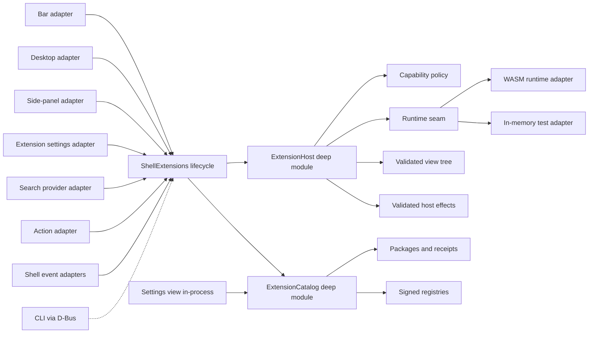
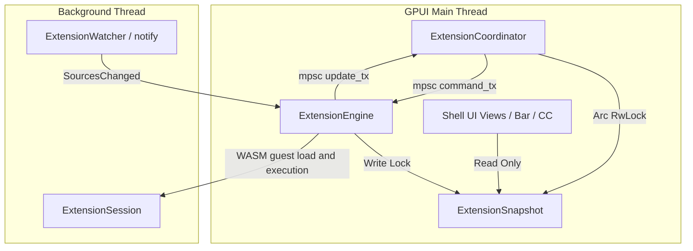

# Shilpo Extension Architecture

## Decision

Shilpo extensions use:

- a versioned TOML manifest for static metadata, contributions, settings, and permissions;
- WebAssembly Component Model modules for optional extension logic;
- a small, declarative view tree rendered by Shilpo with GPUI and `shilpo-ui`;
- host-owned lifecycle, state, scheduling, persistence, diagnostics, and capability enforcement;
- path-based development extensions and packaged end-user extensions using the same runtime.

An extension never receives a GPUI `App`, `Window`, entity, shell runtime handle, service implementation, or
unrestricted operating-system access.

This deliberately combines two proven ideas:

- Zed's versioned manifest, WASM isolation, capability grants, development override, and separation of installed files
  from extension-owned data.
- Noctalia's manifest-declared shell contribution points, instance-aware widgets, shared background logic, settings
  integration, local development sources, and extension catalog.

## Goals

The system must support:

- bar widgets;
- desktop widgets such as clocks, notes, and monitors;
- side-panel pages;
- extension-owned settings pages;
- search providers and shell actions;
- background behavior reacting to typed shell events;
- privileged effects such as changing wallpaper only after an explicit capability grant;
- development, installation, update, disable, recovery, and uninstall workflows.

The system must also keep the shell usable when an extension is invalid, slow, incompatible, or crashes.

## Non-goals

The extension runtime does not support:

- native Rust dynamic libraries;
- direct construction of arbitrary GPUI elements;
- direct access to `ShellRuntime` or Shilpo service implementations;
- extensions replacing core surfaces such as the lock screen or notification daemon;
- extension-to-extension dependencies;
- arbitrary code execution without a narrow manifest declaration and user grant;
- registry hosting or marketplace publisher credentials inside the Shilpo client.

## Why WASM and declarative UI

| Option                             | Benefit                                                                                      | Problem                                                                           | Decision                              |
|------------------------------------|----------------------------------------------------------------------------------------------|-----------------------------------------------------------------------------------|---------------------------------------|
| Rust dynamic library               | Direct GPUI access and maximum flexibility                                                   | No stable Rust ABI, no isolation, and an extension can crash or corrupt the shell | Reject                                |
| Extension process over JSON-RPC    | Strong process isolation and language independence                                           | Process lifecycle and render round trips are expensive for many small widgets     | Reserve for future external providers |
| Embedded scripting language        | Fast iteration and simple packaging                                                          | Adds a language/runtime and weakens compile-time contracts                        | Reject for version 1                  |
| WASM component with declarative UI | Stable versioned contract, resource limits, portable packages, and host-controlled rendering | Requires a constrained view protocol                                              | Select                                |

The constrained view protocol is intentional. The shell owns layout safety, theme tokens, accessibility, focus behavior,
and rendering performance. Extensions supply state and intent, not raw drawing access.

The protocol supports both basic layout primitives and semantic host-rendered components. A component such as
`loading_indicator` is expressed by the guest and rendered by the shell with the corresponding `shilpo-ui` component.
Semantic color tokens are resolved against the surface and active theme at render time; guests should request tokens
such as `on_surface_variant` instead of selecting separate light and dark colors.

## Module shape



### `shilpo-ext-api` and `shilpo-ext-runtime`

The extension ecosystem is split across two dependency-aligned crates:

- **`shilpo-ext-api`** (`core/ext-api`) is the cross-platform extension contract crate. It owns extension identity types (`ExtensionId`, `ContributionId`, `CanonicalId`, `IdError`), manifest parsing and validation, contribution descriptors, settings schema types, shell event and host-effect messages, capability declarations, the declarative view tree and UI event types, versioned schema files, and the provisional WIT source (`wit/extension.wit`). Cross-platform, zero Wasmtime or desktop dependencies.
- **`shilpo-ext-runtime`** (`desktop/ext-runtime`) is the Linux desktop extension runtime crate. It owns capability authorization, Wasmtime Component Model execution, package catalog and registry management, and the worker process framing and protocol (`shilpo extension-host`). Internal to Linux desktop.

`shilpo-ext-api` does not depend on GPUI, `shilpo-ui`, `shilpo`, or concrete service implementations. Declarative configuration lives inside `shilpo` and depends only on `shilpo-ext-api` for extension-reference validation.

### `ExtensionHost`

The host is a deep module owned within the shell's `ShellExtensions` lifecycle module. It hides:

- manifest and compatibility validation;
- WASM loading and instance dispatch;
- capability decisions;
- deadlines, memory limits, fuel budgets, and failure fuses;
- view-tree validation and effect dispatch;
- extension diagnostics.

Shell callers use the host to register validated extensions, deliver typed events, request validated views, and inspect
diagnostics. They do not manage WASM instances, permissions, files, or extension tasks themselves. Package discovery,
installation, and update decisions remain behind the separate `ExtensionCatalog` interface.

### Runtime seam

The runtime seam has two justified adapters:

- a production WASM Component Model adapter;
- an in-memory adapter for deterministic lifecycle, event, view, and capability tests.

The runtime adapter executes guest functions. It does not decide shell policy. Capability checks, scheduling, and effect
validation remain in `ExtensionHost`.

The current component ABI is versioned as `shilpo:extension@0.1.0` and carries JSON strings for the provisional
`ExtensionEvent`, `HostEffect`, and `ViewTree` representations. The WIT-only typed contract, generated host/guest
bindings, explicit activation record, and removal of general `process:exec` are designed in #76; this migration does
not claim those guarantees. During the `@0.x` epoch the ABI may break freely; compatibility hosting is deferred.

### Guest SDKs

The primary extension authoring path is **TypeScript**, compiled to a WASM Component via
[ComponentizeJS](https://github.com/nickvidal/ComponentizeJS) (Bytecode Alliance). The `shilpo ext build` command
handles compilation transparently — authors write TypeScript, the toolchain produces a conformant WASM component.

The TypeScript SDK (`@shilpo/ext-sdk`) uses Raycast-inspired API naming conventions (`List`, `Detail`, `Form`,
`ActionPanel`, `Action.Push`) to lower the barrier for web developers familiar with that ecosystem. This is a
design-level inspiration, not a runtime compatibility layer.

Rust extensions compile directly to `wasm32-wasip2` components using the standard `cargo` toolchain and
`wit-bindgen`-generated bindings.

Rust-generated WASI Preview 2 components receive a default-deny WASI context so the Rust component adapter can
initialize. It has closed stdin, discarded stdout/stderr, no arguments or environment, no preopened directories, and
network addresses denied by default. Filesystem, network, process, wallpaper, clipboard, and other privileged work
remains available only through declared, granted, and host-validated effects.

### Shell adapters

Each surface owns a thin adapter from a contribution to an existing Shilpo surface:

- bar adapter;
- desktop widget adapter;
- side-panel adapter;
- settings adapter;
- search provider adapter;
- action adapter;
- event adapters for theme, palette, wallpaper, output, network, media, and other stable shell events.

Adapters translate surface context into `ExtensionInput` and translate a validated
`ViewTree` into GPUI elements. They never expose the surface implementation to the guest.

The unified `shilpo` binary owns the single production `ShellExtensions` lifecycle module. The Settings view accesses
the `ExtensionCatalog` in-process (no IPC needed). The CLI reaches the running shell via D-Bus (`org.shilpo.Shell`).
Development registrations are scanned for manifest, component, settings-schema, and asset changes. A replacement
generation is built completely before activation, so a broken edit leaves the last valid runtime and view tree active.
Reconciliation runs after output, configuration, and catalog changes.

## Threading Topology and Off-Main-Thread Execution Seams

To guarantee that guest execution, filesystem IO, WASM loading, catalog rescans, and file watching never stall GPUI's 60
FPS rendering pipeline, the extension subsystem is decoupled into a GPUI coordinator and a background worker engine:



### Components

1. **`ExtensionEngine<R>` (Background Worker Thread)**
    - Executes Wasmtime guest module loading, WASM guest function invocations (`view`, `on-event`), catalog rescans,
      manifest parsing, settings schema reading, and filesystem fingerprinting.
    - Listens on `mpsc::Receiver<ExtensionCommand>` in a dedicated background task loop.
    - Emits `ExtensionUpdate` messages over sync channel to `ExtensionCoordinator` and updates the shared immutable
      `ExtensionSnapshot` in `Arc<RwLock<ExtensionSnapshot>>`.
2. **`ExtensionCoordinator` (GPUI Thread Handle)**
    - Owned by `ShellRuntime` on the GPUI main thread.
    - Exposes zero-allocation `Arc<RwLock<ExtensionSnapshot>>` for immediate synchronous reads of pre-validated
      `ViewTree`s, `ContributionDescriptor`s, and `settings_schemas`.
    - Sends user inputs, lifecycle events, and surface reconciliations as channel commands (`ExtensionCommand::Input`,
      `ExtensionCommand::Lifecycle`, `ExtensionCommand::ReconcileInstances`).
    - Generation tracking (`ExtensionGeneration`) on snapshots and commands guarantees that stale responses from
      reloaded or disabled extensions are safely ignored.
3. **`ExtensionWatcher` (Background File Watcher)**
    - Wraps `notify::RecommendedWatcher` monitoring development registrations (`development-registrations.json`),
      installed packages (`installed`), and active symlinks (`activated`).
    - Dispatches debounced `ExtensionCommand::SourcesChanged` messages to `ExtensionEngine` without periodic filesystem
      polling loops.

## Package model

An installed package has this shape:

```text
world-clock/
├── extension.toml
├── extension.wasm
├── README.md
├── LICENSE
├── assets/
├── i18n/
└── settings.schema.json
```

Static contributions are readable from `extension.toml` without executing code. A data-only extension may omit
`extension.wasm` when its contributions need no logic.

Package identity is the manifest ID, not a directory name. IDs use reverse-domain form, for example
`io.github.alice.world-clock`. Contribution IDs are stable within that namespace, producing canonical IDs such as:

```text
io.github.alice.world-clock/bar
io.github.alice.world-clock/desktop
io.github.alice.world-clock/settings
```

## Publisher identity and trust

Built-ins and extensions use separate namespaces:

- `builtin:*` identifies functionality compiled into Shilpo;
- `ext:<extension-id>/<contribution-id>` identifies every extension contribution, including contributions shipped by the
  Shilpo project.

Extension trust comes from verified package provenance, not from its ID or a field in
`extension.toml`. A manifest cannot declare itself official or verified. Shilpo assigns one of these host-owned trust
states after checking the installation source and package signature:

| Trust state          | Meaning                                                            |
|----------------------|--------------------------------------------------------------------|
| `official`           | Signed by a Shilpo-controlled publisher key                        |
| `verified-publisher` | Signed by a publisher identity verified by a trusted registry      |
| `signed-third-party` | Signature is valid, but the publisher has no registry verification |
| `unverified`         | Local or remote package without a trusted publisher identity       |

Official extensions may conventionally use an `org.shilpo.*` ID, but the namespace alone never grants the official trust
state. Official and third-party extensions use the same WASM sandbox, resource limits, effect validation, and capability
review. Official status does not grant implicit permissions.

Shilpo persists a host-owned installation receipt separately from immutable package files. The receipt records at least:

```toml
schema_version = 1
id = "io.github.alice.world-clock"
selected_channel = "stable"

[active]
version = "1.3.0"
source = "registry:https://extensions.shilpo.org/index.json"
publisher = "alice"
publisher_key = "sha256:<fingerprint>"
publisher_public_key = "<base64-ed25519-public-key>"
package_hash = "sha256:<digest>"
trust = "verified-publisher"
channel = "stable"
installed_at_unix_seconds = 1785067200
```

`previous` and `pending` use the same complete provenance shape. This ensures rollback restores the matching digest,
source, publisher identity, trust, and channel rather than only changing a version string.

An update must preserve the extension ID and publisher-key continuity. Publisher key rotation requires a delegation
signed by the previous key or by a trusted registry root. A package with the same ID but an unrelated publisher key is a
conflict, not an update.

## Publication and registry model

Publication produces an immutable, versioned `.shilpo-ext` archive. The author workflow is:

```text
source → check → build WASM → pack → sign → publish archive and release metadata
```

`shilpo ext check` validates the manifest, referenced files, settings defaults, capabilities, package limits, and WASM
interface. `shilpo ext pack` includes runtime files only. `shilpo ext keygen` creates an Ed25519 publisher key and
`shilpo ext sign` signs the package digest and publisher metadata. Uploading the immutable package and release entry is
registry-specific; Shilpo's client does not receive registry publishing credentials.

A signed registry release entry contains:

```json
{
  "id": "io.github.alice.world-clock",
  "name": "World Clock",
  "description": "Shows several time zones",
  "publisher": "alice",
  "version": "1.3.0",
  "api_version": "0.2.0",
  "min_shilpo_version": "0.2.0",
  "channel": "stable",
  "package_url": "https://extensions.shilpo.org/packages/world-clock-1.3.0.shilpo-ext",
  "package_hash": "sha256:<digest>",
  "publisher_public_key": "<base64-ed25519-public-key>",
  "publisher_signature": "<base64-ed25519-signature>",
  "capabilities_hash": "sha256:<digest>",
  "capabilities": [],
  "published_at": "2026-07-26T12:00:00Z",
  "yanked": false,
  "verified_publisher": true,
  "open_source": true,
  "data_only": false,
  "key_rotation": null
}
```

The release entries are wrapped in an index containing `schema_version`, `source_id`, and `generated_at`; the outer
envelope contains that index and its Ed25519 `signature`. The exact JSON contracts are generated as
`package-signature-v1.schema.json` and `registry-index-v1.schema.json`. The registry signature is independent from
publisher package signatures, allowing Shilpo to verify both who published a package and which release metadata the
registry served. Advanced users may add explicitly trusted third-party registries with an independently obtained root
public key.

Direct distribution through a website or release service is supported by installing a local archive or signed URL. A
one-off package URL has no update-discovery contract. Publishing through a trusted signed registry provides update
discovery. Installing Git repository source remains a development workflow.

Public gallery hosting and automated registry publishing are deployment concerns outside the Shilpo client. They must
produce the same signed index and immutable package contracts described here.

## Contribution model

Contributions describe what an extension adds. They do not grant permission to perform effects.

| Contribution      | Instance model                                    | Host responsibilities                                                |
|-------------------|---------------------------------------------------|----------------------------------------------------------------------|
| `bar_widget`      | Zero or more instances per output and bar section | Orientation, height, spacing, accessibility, and interaction routing |
| `desktop_widget`  | Zero or more persistent instances per output      | Bounds, drag/resize, stacking, output migration, and edit mode       |
| `side_panel`      | Singleton or per-output instance                  | Surface placement, focus, dismissal, and size constraints            |
| `settings_page`   | Singleton                                         | Navigation, save/cancel, validation, and permission display          |
| `search_provider` | Singleton background provider                     | Query dispatch via `SearchSink`, result ranking, cancellation        |
| `action`          | Singleton descriptor                              | Keybinding discovery, enablement, dispatch, and diagnostics          |
| `background_task` | Singleton guest state owner                       | Startup, event delivery, timers, quotas, restart, and shutdown       |

The manifest declares contribution definitions. User configuration creates contribution instances and chooses placement.
This permits two clocks with different settings without loading the extension twice.

## Declarative view tree

The initial node set should stay small:

- `row`, `column`, `stack`, and `scroll`;
- `text`, `icon`, and sandboxed asset `image`;
- `button`, `icon_button`, `toggle`, `slider`, and `text_input`;
- `list` with bounded item counts;
- `spacer`, `divider`, `badge`, and `progress`.

Styling uses semantic Shilpo tokens such as `primary`, `surface_container`, standard spacing, typography, shape, and
motion roles. Arbitrary shaders, fonts, global CSS-like rules, filesystem image paths, and raw GPUI elements are
excluded.

Every interactive node carries a guest-defined event ID. The GPUI adapter returns that ID and a typed value to the host.
The guest updates its state and returns a new view tree.

When a guest emits `invalidate_view`, the engine converts the effect into a canonical contribution invalidation,
rebuilds the immutable snapshot from the guest's current state, and asks the owning GPUI surface to repaint. The effect
is therefore a coordination signal rather than a service operation; without the snapshot rebuild, a surface could remain
on its initial cached tree.

The host rejects trees that exceed configured depth, node count, text, image, or list limits. The last valid tree stays
visible if a later render fails.

## Events and effects

Extensions receive versioned immutable events. The Rust enum variants serialize with snake-case wire names. Initial
event families include:

- `shell_started` and `shell_stopping`;
- `outputs_changed`;
- `theme_changed`;
- `palette_generated`;
- `wallpaper_changed`;
- `network_changed`;
- `media_changed`;
- `power_changed`;
- `timer_fired`;
- contribution mount, unmount, resize, and input events.

Events are coalesced where only the latest state matters. A slow extension never blocks the GPUI thread.

Extensions return effects instead of directly mutating the shell or operating system. Examples:

- invalidate a contribution view;
- show a notification;
- invoke a registered shell action;
- set a wallpaper;
- request a new palette source;
- read or write extension-owned state;
- read system location coordinates (`location_read`);
- make an HTTP request;
- execute an allow-listed command.

The host validates every effect against the manifest, the user's grants, and current shell policy before calling a
concrete adapter.

HTTP effects carry a guest-defined request ID. The raw guest URL is parsed once by `ExtensionHost` into a canonical HTTP
target, where HTTPS, `GET`, host presence, credential absence, and fragment absence are verified before constructing an
authorized request type. Both the declared manifest scope and user grant match the same canonical host/path (host
patterns exclude ports and path patterns exclude queries, while the parsed `Url` retains both for transport). The shell
transports that exact parsed URL without reparsing raw text. The host permits bounded HTTPS `GET` requests, disables
redirects, limits response bodies to 1 MiB, and returns status/body/error through a correlated `http_response` event.
The guest never receives a socket or ambient network stack. A host-generated `timer_fired` event named `minute` provides
a coarse refresh heartbeat without giving guests their own schedulers.

### Host-Owned Location Capability & Privacy Model

System location access uses a host-owned `location:read` capability rather than in-extension IP geocoding:

1. **Manifest Declaration**: Extensions requesting location must declare `[[capabilities]] kind = "location:read"`.
2. **Host Location Provider**: On Linux, the host queries the desktop location daemon (`org.freedesktop.GeoClue2` via
   D-Bus).
3. **Location Response & Caching**: The host returns `{ latitude, longitude, accuracy_meters }` via `location_response`
   event and caches coordinates to minimize battery and IPC overhead.
4. **Location Modes**: Extensions (such as Weather) support `automatic` (GeoClue system location), `manual` (configured
   city/coordinates), and `ip` (explicit opt-in fallback). If system location is temporarily unavailable, extensions
   retain their last valid snapshot.

## Capabilities

Contribution declarations and capabilities are separate. A clock can render without filesystem or process access.

Initial capabilities:

| Capability                           | Scope examples                               |
|--------------------------------------|----------------------------------------------|
| `events:subscribe`                   | `palette_generated`, `wallpaper_changed`     |
| `wallpaper:read`                     | Current wallpaper metadata                   |
| `wallpaper:set`                      | User-selected files or extension assets      |
| `theme:read`                         | Semantic tokens and current mode             |
| `theme:set_source`                   | Request a new source color                   |
| `notifications:show`                 | Extension-attributed notifications           |
| `clipboard:read` / `clipboard:write` | Separate grants                              |
| `network:http`                       | Explicit host and path patterns              |
| `filesystem:read`                    | Extension assets/data or user-selected roots |
| `filesystem:write`                   | Extension data or user-selected roots        |
| `actions:invoke`                     | Explicit shell action IDs                    |

There is no ambient WASI filesystem, environment, network, or process access. WASM guests cannot execute child processes or invoke scripts. Capability changes on update require
renewed approval. Grants are persisted separately from the package so replacing package files cannot grant new
authority.

### Trusted Local Scripts

Shilpo also supports **trusted local scripts** for read-only status bar widgets.

- **Discovery**: `$XDG_CONFIG_HOME/shilpo/scripts/<bundle>/manifest.toml` (immediate child directories only).
- **Trust Boundary**: Scripts are local-only programs running with the user's OS authority. WASM guests cannot invoke, configure, or influence scripts.
- **Execution Boundary**: Supervised strictly inside the private `shilpo extension-host` worker process—never in the Shell/GPUI process.
- **Surface**: Read-only bar widgets in v1. Interactive nodes and event handlers are rejected.
- **Process Supervision**: Child process groups are spawned with `setpgid` and cleanly terminated (`SIGKILL`) and reaped (`wait`) on timeout, reload, removal, or host shutdown. Stderr is captured up to 64 KiB.

## Lifecycle and failure policy

1. Discover package or development path.
2. Parse and validate the manifest without running code.
3. Check schema, extension interface, and minimum shell versions.
4. Resolve capability grants.
5. Compile or load the cached WASM component.
6. Activate one guest instance per extension.
7. Mount configured contribution instances.
8. Deliver events and input on a background executor.
9. Apply validated changes on the GPUI thread.
10. Unmount, cancel work, and deactivate during reload, disable, or shutdown.

Each call has a deadline, memory ceiling, and WASM fuel budget. Repeated traps, timeouts, invalid view trees, or invalid
effects trip a circuit breaker. The host disables the extension for the session, preserves its files and settings,
displays an error placeholder, and records an actionable diagnostic.

Development reload preserves host-owned settings and state where schemas remain compatible. Production updates are
atomic and retain the previous working package for rollback.

## Storage and source precedence

Linux catalog paths:

```text
$XDG_CONFIG_HOME/shilpo/extensions/sources.toml
$XDG_CONFIG_HOME/shilpo/extensions/grants/<id>.toml
$XDG_DATA_HOME/shilpo/extensions/installed/<id>/<version>/
$XDG_DATA_HOME/shilpo/extensions/receipts/<id>.toml
$XDG_DATA_HOME/shilpo/extensions/indexes/<source>.json
$XDG_DATA_HOME/shilpo/extensions/staging/
$XDG_STATE_HOME/shilpo/extensions/dev/<id>.toml
$XDG_STATE_HOME/shilpo/extensions/logs/
```

Source precedence is deterministic:

1. explicit development path;
2. user-installed package;

A higher-precedence source with the same ID overrides, rather than combines with, the lower source. Removing a
development override reveals the installed version again.

## Versioning

The manifest carries three distinct versions:

- `schema_version`: package-manifest format;
- `api_version`: guest/host WIT interface;
- `version`: extension release.

During the `@0.x` epoch, Shilpo supports only the current WIT interface version. Extensions targeting an older `@0.x`
interface must be recompiled. At `@1.0`, Shilpo will support a documented range of interface versions and retain
versioned WIT worlds for backward compatibility. An incompatible extension is discoverable in settings but is never
executed.

Contribution and setting IDs are persistent data keys. Renaming one requires a manifest migration. Extension settings
are validated before activation, and the previous valid settings remain active after a failed edit or migration.
Extension-wide settings live under `extensions.settings."<extension-id>"`; surface instances may overlay values without
giving the guest access to the shell's full configuration.

## Extension catalog and update discovery

`ExtensionCatalog` is the host-owned deep module for discovery and updates. Its interface returns catalog snapshots and
update plans; callers do not fetch indexes, compare versions, verify signatures, or manipulate package directories
themselves. It hides:

- registry and signed-feed fetching;
- index and publisher-signature verification;
- source precedence and duplicate-ID conflicts;
- compatible release selection;
- trust-state assignment;
- capability-difference calculation;
- staged download, integrity verification, and rollback metadata.

Official and third-party registries are production adapters at the release-source seam. Tests use signed-index fixtures.
Settings and CLI callers consume the same catalog snapshot so update decisions cannot diverge between interfaces.

An update check selects the highest non-yanked semantic version that:

- has the same extension ID and expected publisher identity;
- belongs to the user's selected channel;
- is newer than the installed version;
- supports the running Shilpo version;
- uses a supported extension interface version;
- has valid registry metadata and package signatures.

Stable is the default channel. Prerelease versions require an explicit beta or development channel. Users initiate
registry refreshes and update installation through Settings or the CLI. Extension guest code never performs its own
update check.

Update behavior depends on the recorded installation source:

| Source                       | Update behavior                                                              |
|------------------------------|------------------------------------------------------------------------------|
| Official or trusted registry | Catalog discovery and user-triggered installation                            |
| One-off local or URL package | Manual replacement only                                                      |
| Development path             | Never updated automatically; installed-version updates may still be reported |

Activation is transactional:

1. download into a staging directory;
2. verify index signature, publisher signature, and package hash;
3. parse and validate the manifest without executing the guest;
4. confirm identity, publisher continuity, and compatibility;
5. compare requested capabilities with stored grants;
6. compile or validate the WASM component;
7. atomically activate the new version;
8. retain the previous working version for rollback.

An update that requests broader capabilities may be staged, but remains inactive until the user reviews the new grants.
A failed activation restores the previous version. Yanked releases are not selected for new updates; settings presents
remediation when an installed release becomes yanked.

Observable update states include `up-to-date`, `available`, `awaiting-permission-review`, `incompatible`,
`publisher-conflict`, `yanked`, `failed-using-previous-version`, `rollback-active`, and
`development-override-active`.

## Settings discovery experience

The Settings view (part of the unified `shilpo` binary) is the primary graphical discovery and management interface:

```text
Settings
└── Extensions
    ├── Discover
    ├── Installed
    ├── Updates
    └── Sources
```

The Settings module renders `ExtensionCatalog` snapshots. It does not independently fetch registry data, assign trust,
verify packages, or activate versions.

Discover supports search by extension, description, publisher, and capability; categories for contribution surfaces; and
filters for official, verified, signed third-party, open-source, compatible, and data-only extensions. Featured,
popular, recently updated, and new collections are registry metadata, visibly attributed to their source.

An extension listing and detail page show:

- name, icon, description, version, license, and repository;
- publisher identity, trust badge, and registry source;
- contributed surfaces;
- requested capabilities;
- Shilpo and extension-interface compatibility;
- release date, signature status, and yanked state.

Listing metadata is read from a verified registry snapshot. Merely browsing an extension never downloads or executes its
guest module.

Installation proceeds through details, publisher/capability review, verified download, disabled installation, permission
grants, enablement, and optional contribution placement. Installing an extension does not automatically add every widget
or approve sensitive capabilities.

Installed shows enablement, current version, trust, grants, contribution instances, diagnostics, logs, and development
overrides. Updates groups ordinary updates, updates awaiting permission review, incompatible releases, and rollback
results. Sources manages the official registry and explicitly trusted third-party registries.

The `shilpo ext search` CLI consumes the same signed catalog metadata. A future web listing may deep-link into the
Settings detail page, but cannot bypass package verification or permission review.

Two sources cannot silently replace the same extension ID with different publisher keys. The catalog reports the
collision and requires an explicit user decision.

## Operational ecosystem

Shipping a public ecosystem additionally requires work that does not belong inside the runtime or distribution modules:

- host and curate the official signed registry;
- provide publisher submission and registry-index signing automation;
- add a configurable background update schedule if desired;
- build a public web gallery if desired;
- provide a higher-level guest SDK and extension scaffolding.

## Test surface

Tests cross the `ExtensionHost` interface and assert observable outcomes:

- manifest and compatibility diagnostics;
- source precedence and development override;
- contribution discovery and instance reconciliation;
- settings defaulting, validation, and migration;
- event coalescing and cancellation;
- capability allow/deny behavior;
- valid and invalid view trees;
- timeout, trap, memory, and repeated-error handling;
- atomic update and rollback;
- publisher continuity, source collision, channel, yanked-release, and compatibility selection;
- identical catalog outcomes through Settings and CLI callers;
- multi-output mount/unmount behavior;
- shutdown cancellation and state persistence.

Tests use the in-memory runtime adapter. A smaller conformance suite runs the same fixtures through the WASM adapter.
