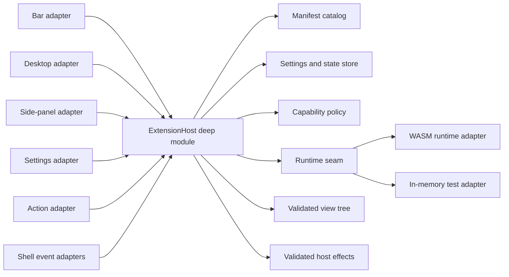

# Shilpo Extension Architecture

Status: accepted architecture. Phases 1 and 2 are implemented: the contract, policy host, in-memory and Component Model
runtimes, schemas, namespaced shell references, resource/failure policy, development CLI, deterministic package
creation, and a buildable example. Shell-surface adapters, automatic hot reload, installation, signing, registries,
updates, and Settings discovery remain planned.

## Decision

Shilpo extensions will use:

- a versioned TOML manifest for static metadata, contributions, settings, and permissions;
- WebAssembly Component Model modules for optional extension logic;
- a small, declarative view tree rendered by Shilpo with GPUI and `shilpo-ui`;
- host-owned lifecycle, state, scheduling, persistence, diagnostics, and capability enforcement;
- path-based development extensions and packaged end-user extensions using the same runtime.

An extension never receives a GPUI `App`, `Window`, entity, shell runtime handle, service implementation, or
unrestricted operating-system access.

This deliberately combines two proven ideas:

- Zed's versioned manifest, WASM isolation, capability grants, development override, and separation of installed files
  from extension-owned data.
- Noctalia's manifest-declared shell contribution points, instance-aware widgets, shared background logic, settings
  integration, local development sources, and extension catalog.

## Goals

The system must support:

- bar widgets;
- desktop widgets such as clocks, notes, and monitors;
- side-panel pages and control-center entries;
- extension-owned settings pages;
- launcher providers and shell actions;
- background behavior reacting to typed shell events;
- privileged effects such as changing wallpaper only after an explicit capability grant;
- development, installation, update, disable, recovery, and uninstall workflows.

The system must also keep the shell usable when an extension is invalid, slow, incompatible, or crashes.

## Non-goals

The first version will not support:

- native Rust dynamic libraries;
- direct construction of arbitrary GPUI elements;
- direct access to `ShellRuntime` or Shilpo service implementations;
- extensions replacing core surfaces such as the lock screen or notification daemon;
- extension-to-extension dependencies;
- arbitrary code execution without a narrow manifest declaration and user grant;
- marketplace auto-publishing before package verification and update rollback exist.

## Why WASM and declarative UI

| Option                             | Benefit                                                                                      | Problem                                                                           | Decision                              |
|------------------------------------|----------------------------------------------------------------------------------------------|-----------------------------------------------------------------------------------|---------------------------------------|
| Rust dynamic library               | Direct GPUI access and maximum flexibility                                                   | No stable Rust ABI, no isolation, and an extension can crash or corrupt the shell | Reject                                |
| Extension process over JSON-RPC    | Strong process isolation and language independence                                           | Process lifecycle and render round trips are expensive for many small widgets     | Reserve for future external providers |
| Embedded scripting language        | Fast iteration and simple packaging                                                          | Adds a language/runtime and weakens compile-time contracts                        | Reject for version 1                  |
| WASM component with declarative UI | Stable versioned contract, resource limits, portable packages, and host-controlled rendering | Requires a constrained view protocol                                              | Select                                |

The constrained view protocol is intentional. The shell owns layout safety, theme tokens, accessibility, focus behavior,
and rendering performance. Extensions supply state and intent, not raw drawing access.

## Module shape



### `shilpo-ext`

`crates/ext` becomes the stable contract shared with extension authors. It owns:

- identifiers and semantic-version compatibility types;
- manifest parsing and validation;
- contribution descriptors;
- settings schema types;
- shell event and host-effect messages;
- capability declarations;
- the declarative view tree and UI event types;
- generated WIT bindings and the Rust guest SDK.

It should not depend on GPUI, `shilpo-ui`, `shilpo-shell`, or concrete service implementations. Its current
`ShellExtension` trait and GPUI dependency should be replaced when implementation begins.

### `ExtensionHost`

The host is a deep module owned by `ShellRuntime`. It hides:

- discovery and source precedence;
- manifest and compatibility validation;
- WASM compilation and instance lifecycle;
- capability decisions;
- scheduling, timeouts, memory limits, and failure fuses;
- settings and state persistence;
- hot reload and update rollback;
- view-tree validation and effect dispatch;
- extension diagnostics.

Shell surfaces call the host through a small interface:

```rust,ignore
pub struct ExtensionHost;

impl ExtensionHost {
    pub async fn reconcile(&mut self, sources: ExtensionSources) -> ExtensionCatalogSnapshot;
    pub async fn dispatch(&mut self, input: ExtensionInput) -> ExtensionChanges;
    pub fn view(&self, instance: &ContributionInstanceId) -> Option<&ViewTree>;
    pub async fn shutdown(&mut self);
}
```

The exact Rust types may change during implementation. The invariant is that shell callers send typed inputs and consume
snapshots/changes; they do not manage WASM instances, permissions, files, or extension tasks themselves.

### Runtime seam

The runtime seam has two justified adapters:

- a production WASM Component Model adapter;
- an in-memory adapter for deterministic lifecycle, event, view, and capability tests.

The runtime adapter executes guest functions. It does not decide shell policy. Capability checks, scheduling, and effect
validation remain in `ExtensionHost`.

The Phase 2 world is versioned as `shilpo:extension@0.1.0` and exports `on-event(string) -> string` and
`view(string) -> string`. The strings encode the contract crate's typed events, effects, and view trees as JSON. The
small ABI avoids duplicating policy or UI types in generated bindings; a later guest SDK will wrap this wire format.

Rust-generated WASI Preview 2 components receive a default-deny WASI context so the Rust component adapter can
initialize. It has closed stdin, discarded stdout/stderr, no arguments or environment, no preopened directories, and
network addresses denied by default. Filesystem, network, process, wallpaper, clipboard, and other privileged work
remains available only through declared, granted, and host-validated effects.

### Shell adapters

Each surface owns a thin adapter from a contribution to an existing Shilpo surface:

- bar adapter;
- desktop widget adapter;
- side-panel/control-center adapter;
- settings adapter;
- launcher adapter;
- action adapter;
- event adapters for theme, palette, wallpaper, output, network, media, and other stable shell events.

Adapters translate surface context into `ExtensionInput` and translate a validated
`ViewTree` into GPUI elements. They never expose the surface implementation to the guest.

## Package model

An installed package has this shape:

```text
world-clock/
├── extension.toml
├── extension.wasm
├── README.md
├── LICENSE
├── assets/
├── i18n/
└── settings.schema.json
```

Static contributions are readable from `extension.toml` without executing code. A data-only extension may omit
`extension.wasm` when its contributions need no logic.

Package identity is the manifest ID, not a directory name. IDs use reverse-domain form, for example
`io.github.alice.world-clock`. Contribution IDs are stable within that namespace, producing canonical IDs such as:

```text
io.github.alice.world-clock/bar
io.github.alice.world-clock/desktop
io.github.alice.world-clock/settings
```

## Publisher identity and trust

Built-ins and extensions use separate namespaces:

- `builtin:*` identifies functionality compiled into Shilpo;
- `ext:<extension-id>/<contribution-id>` identifies every extension contribution, including contributions shipped by the
  Shilpo project.

Extension trust comes from verified package provenance, not from its ID or a field in
`extension.toml`. A manifest cannot declare itself official or verified. Shilpo assigns one of these host-owned trust
states after checking the installation source and package signature:

| Trust state          | Meaning                                                            |
|----------------------|--------------------------------------------------------------------|
| `official`           | Signed by a Shilpo-controlled publisher key                        |
| `verified-publisher` | Signed by a publisher identity verified by a trusted registry      |
| `signed-third-party` | Signature is valid, but the publisher has no registry verification |
| `unverified`         | Local or remote package without a trusted publisher identity       |

Official extensions may conventionally use an `org.shilpo.*` ID, but the namespace alone never grants the official trust
state. Official and third-party extensions use the same WASM sandbox, resource limits, effect validation, and capability
review. Official status does not grant implicit permissions.

Shilpo persists a host-owned installation receipt separately from immutable package files. The receipt records at least:

```toml
id = "io.github.alice.world-clock"
version = "1.3.0"
source = "registry:https://extensions.shilpo.org/index.json"
publisher = "alice"
publisher_key = "sha256:<fingerprint>"
package_hash = "sha256:<digest>"
trust = "verified-publisher"
channel = "stable"
```

An update must preserve the extension ID and publisher-key continuity. Publisher key rotation requires a delegation
signed by the previous key or by a trusted registry root. A package with the same ID but an unrelated publisher key is a
conflict, not an update.

## Publication and registry model

Publication produces an immutable, versioned `.shilpo-ext` archive. The planned author workflow is:

```text
source → check → build WASM → pack → sign → publish archive and release metadata
```

`shilpo ext check` validates the manifest, referenced files, settings defaults, capabilities, package limits, and WASM
interface. `shilpo ext pack` includes runtime files only. `shilpo ext sign` signs the package digest and publisher
metadata. `shilpo ext
publish` submits the immutable package and release entry to a registry.

A signed registry release entry contains:

```json
{
  "id": "io.github.alice.world-clock",
  "version": "1.3.0",
  "api_version": "0.1.0",
  "min_shilpo_version": "0.2.0",
  "channel": "stable",
  "package_url": "https://extensions.shilpo.org/packages/world-clock-1.3.0.shilpo-ext",
  "package_hash": "sha256:<digest>",
  "publisher_key": "sha256:<fingerprint>",
  "signature": "<signature>",
  "capabilities_hash": "sha256:<digest>",
  "published_at": "2026-07-26T12:00:00Z",
  "yanked": false
}
```

The registry signs its index independently from publisher package signatures. This lets Shilpo verify both who published
a package and which release metadata the registry served. The official registry is configured by default. Advanced users
may add explicitly trusted third-party registries.

Direct distribution through a website or release service is supported by installing a local archive or signed URL. A
one-off package URL has no update-discovery contract. Automatic updates from a direct source require a signed update
feed or trusted registry entry. Installing Git repository source remains a development workflow.

No public gallery or automatic registry publishing is enabled until package signature verification, publisher
continuity, atomic activation, and rollback are implemented.

## Contribution model

Contributions describe what an extension adds. They do not grant permission to perform effects.

| Contribution        | Instance model                                    | Host responsibilities                                                |
|---------------------|---------------------------------------------------|----------------------------------------------------------------------|
| `bar_widget`        | Zero or more instances per output and bar section | Orientation, height, spacing, accessibility, and interaction routing |
| `desktop_widget`    | Zero or more persistent instances per output      | Bounds, drag/resize, stacking, output migration, and edit mode       |
| `side_panel`        | Singleton or per-output instance                  | Surface placement, focus, dismissal, and size constraints            |
| `control_center`    | Singleton entry, optionally opening a side panel  | Placement and unavailable/error presentation                         |
| `settings_page`     | Singleton                                         | Navigation, save/cancel, validation, and permission display          |
| `launcher_provider` | Singleton background provider                     | Debounce, result limits, cancellation, and launch routing            |
| `action`            | Singleton descriptor                              | Keybinding discovery, enablement, dispatch, and diagnostics          |
| `background_task`   | Singleton guest state owner                       | Startup, event delivery, timers, quotas, restart, and shutdown       |

The manifest declares contribution definitions. User configuration creates contribution instances and chooses placement.
This permits two clocks with different settings without loading the extension twice.

## Declarative view tree

The initial node set should stay small:

- `row`, `column`, `stack`, and `scroll`;
- `text`, `icon`, and sandboxed asset `image`;
- `button`, `icon_button`, `toggle`, `slider`, and `text_input`;
- `list` with bounded item counts;
- `spacer`, `divider`, `badge`, and `progress`.

Styling uses semantic Shilpo tokens such as `primary`, `surface_container`, standard spacing, typography, shape, and
motion roles. Arbitrary shaders, fonts, global CSS-like rules, filesystem image paths, and raw GPUI elements are
excluded.

Every interactive node carries a guest-defined event ID. The GPUI adapter returns that ID and a typed value to the host.
The guest updates its state and returns a new view tree.

The host rejects trees that exceed configured depth, node count, text, image, or list limits. The last valid tree stays
visible if a later render fails.

## Events and effects

Extensions receive versioned immutable events. The Rust enum variants serialize with snake-case wire names. Initial
event families include:

- `shell_started` and `shell_stopping`;
- `outputs_changed`;
- `theme_changed`;
- `palette_generated`;
- `wallpaper_changed`;
- `network_changed`;
- `media_changed`;
- `power_changed`;
- `timer_fired`;
- contribution mount, unmount, resize, and input events.

Events are coalesced where only the latest state matters. A slow extension never blocks the GPUI thread.

Extensions return effects instead of directly mutating the shell or operating system. Examples:

- invalidate a contribution view;
- show a notification;
- invoke a registered shell action;
- set a wallpaper;
- request a new palette source;
- read or write extension-owned state;
- make an HTTP request;
- execute an allow-listed command.

The host validates every effect against the manifest, the user's grants, and current shell policy before calling a
concrete adapter.

## Capabilities

Contribution declarations and capabilities are separate. A clock can render without filesystem or process access.

Initial capabilities:

| Capability                           | Scope examples                               |
|--------------------------------------|----------------------------------------------|
| `events:subscribe`                   | `palette_generated`, `wallpaper_changed`     |
| `wallpaper:read`                     | Current wallpaper metadata                   |
| `wallpaper:set`                      | User-selected files or extension assets      |
| `theme:read`                         | Semantic tokens and current mode             |
| `theme:set_source`                   | Request a new source color                   |
| `notifications:show`                 | Extension-attributed notifications           |
| `clipboard:read` / `clipboard:write` | Separate grants                              |
| `network:http`                       | Explicit host and path patterns              |
| `process:exec`                       | Explicit executable and argument patterns    |
| `filesystem:read`                    | Extension assets/data or user-selected roots |
| `filesystem:write`                   | Extension data or user-selected roots        |
| `actions:invoke`                     | Explicit shell action IDs                    |

There is no ambient WASI filesystem, environment, network, or process access. Capability changes on update require
renewed approval. Grants are persisted separately from the package so replacing package files cannot grant new
authority.

## Lifecycle and failure policy

1. Discover package or development path.
2. Parse and validate the manifest without running code.
3. Check schema, extension interface, and minimum shell versions.
4. Resolve capability grants.
5. Compile or load the cached WASM component.
6. Activate one guest instance per extension.
7. Mount configured contribution instances.
8. Deliver events and input on a background executor.
9. Apply validated changes on the GPUI thread.
10. Unmount, cancel work, and deactivate during reload, disable, or shutdown.

Each call has a deadline, memory ceiling, and WASM fuel budget. Repeated traps, timeouts, invalid view trees, or invalid
effects trip a circuit breaker. The host disables the extension for the session, preserves its files and settings,
displays an error placeholder, and records an actionable diagnostic.

Development reload preserves host-owned settings and state where schemas remain compatible. Production updates are
atomic and retain the previous working package for rollback.

## Storage and source precedence

Proposed Linux paths:

```text
$XDG_CONFIG_HOME/shilpo/extensions.toml
$XDG_CONFIG_HOME/shilpo/extensions/<id>.toml
$XDG_DATA_HOME/shilpo/extensions/installed/<id>/<version>/
$XDG_DATA_HOME/shilpo/extensions/data/<id>/
$XDG_CACHE_HOME/shilpo/extensions/compiled/
$XDG_STATE_HOME/shilpo/extensions/logs/
```

Source precedence is deterministic:

1. explicit development path;
2. user-installed package;
3. system-installed package.

A higher-precedence source with the same ID overrides, rather than combines with, the lower source. Removing a
development override reveals the installed version again.

## Versioning

The manifest carries three distinct versions:

- `schema_version`: package-manifest format;
- `api_version`: guest/host WIT interface;
- `version`: extension release.

Shilpo supports a documented range of interface versions and retains versioned WIT worlds for migrations. An
incompatible extension is discoverable in settings but is never executed.

Contribution and setting IDs are persistent data keys. Renaming one requires a manifest migration. Extension settings
are validated before activation, and the previous valid settings remain active after a failed edit or migration.

## Extension catalog and update discovery

`ExtensionCatalog` is the host-owned deep module for discovery and updates. Its interface returns catalog snapshots and
update plans; callers do not fetch indexes, compare versions, verify signatures, or manipulate package directories
themselves. It hides:

- registry and signed-feed fetching;
- index and publisher-signature verification;
- source precedence and duplicate-ID conflicts;
- compatible release selection;
- trust-state assignment;
- capability-difference calculation;
- staged download, integrity verification, and rollback metadata.

Official and third-party registries are production adapters at the release-source seam. Direct signed feeds are another
adapter. Interface tests use an in-memory adapter with signed-index fixtures. Settings and CLI callers consume the same
catalog snapshot so update decisions cannot diverge between interfaces.

An update check selects the highest non-yanked semantic version that:

- has the same extension ID and expected publisher identity;
- belongs to the user's selected channel;
- is newer than the installed version;
- supports the running Shilpo version;
- uses a supported extension interface version;
- has valid registry metadata and package signatures.

Stable is the default channel. Prerelease versions require an explicit beta or development channel. Update checks use
conditional requests and cached signed indexes. Users can check manually; the settings app may also check periodically
according to a configurable policy. Extension guest code never performs its own update check.

Update behavior depends on the recorded installation source:

| Source                       | Update behavior                                                              |
|------------------------------|------------------------------------------------------------------------------|
| Official or trusted registry | Automatic discovery; optional automatic installation                         |
| Signed direct update feed    | Automatic discovery when the feed is explicitly trusted                      |
| One-off local or URL package | Manual replacement only                                                      |
| System-installed package     | Updated by the operating-system package manager                              |
| Development path             | Never updated automatically; installed-version updates may still be reported |

Activation is transactional:

1. download into a staging directory;
2. verify index signature, publisher signature, and package hash;
3. parse and validate the manifest without executing the guest;
4. confirm identity, publisher continuity, and compatibility;
5. compare requested capabilities with stored grants;
6. compile or validate the WASM component;
7. atomically activate the new version;
8. retain the previous working version for rollback.

An update that requests broader capabilities may be staged, but remains inactive until the user reviews the new grants.
A failed activation restores the previous version. Yanked releases are not selected for new updates; settings presents
remediation when an installed release becomes yanked.

Observable update states include `up-to-date`, `available`, `downloading`,
`awaiting-permission-review`, `incompatible`, `publisher-conflict`, `yanked`,
`failed-using-previous-version`, and `development-override-active`.

## Settings discovery experience

The future settings app is the primary graphical discovery and management interface:

```text
Settings
└── Extensions
    ├── Discover
    ├── Installed
    ├── Updates
    └── Sources
```

The Settings module renders `ExtensionCatalog` snapshots. It does not independently fetch registry data, assign trust,
verify packages, or activate versions.

Discover supports search by extension, description, publisher, and capability; categories for contribution surfaces; and
filters for official, verified, signed third-party, open-source, compatible, and data-only extensions. Featured,
popular, recently updated, and new collections are registry metadata, visibly attributed to their source.

An extension listing and detail page show:

- name, icon, description, version, license, and repository;
- publisher identity, trust badge, and registry source;
- contributed surfaces;
- requested capabilities;
- Shilpo and extension-interface compatibility;
- release date, signature status, and yanked state.

Listing metadata is read from a verified registry snapshot. Merely browsing an extension never downloads or executes its
guest module.

Installation proceeds through details, publisher/capability review, verified download, disabled installation, permission
grants, enablement, and optional contribution placement. Installing an extension does not automatically add every widget
or approve sensitive capabilities.

Installed shows enablement, current version, trust, grants, contribution instances, diagnostics, logs, and development
overrides. Updates groups ordinary updates, updates awaiting permission review, incompatible releases, and rollback
results. Sources manages the official registry and explicitly trusted third-party registries.

The planned `shilpo ext search` CLI and public web gallery consume the same signed catalog metadata. A web listing may
deep-link into the Settings detail page, but cannot bypass package verification or permission review.

Two sources cannot silently replace the same extension ID with different publisher keys. The catalog reports the
collision and requires an explicit user decision.

## Required Shilpo refactors

Full shell-surface integration depends on these seams:

1. Replace the closed `BarWidget` enum in `shilpo-config` with a stable `WidgetRef` that can represent both built-ins
   and namespaced extension contributions.
2. Replace the closed `ActionId` enum/registry with string-backed IDs and registered action handlers while preserving
   typed payload validation.
3. Add a shell-owned event stream for palette, theme, wallpaper, output, and service state changes. Extensions must not
   observe concrete service objects.
4. Add host modules for desktop widget instances and side-panel pages. The existing
   `shilpo-ui` primitives are rendering building blocks, not lifecycle owners.
5. Change the settings app from a fixed category enum to a registry that can consume built-in and extension settings
   descriptors.
6. Make `ShellRuntime` own one `ExtensionHost` and reconcile contributions after config, output, and extension-catalog
   changes.

## Delivery sequence

### Phase 1: contract and catalog

- [x] Replace the placeholder `shilpo-ext` interface with manifest, ID, contribution, capability, view-tree, and
  event/effect types.
- [x] Add schema generation and manifest validation.
- [x] Add an in-memory runtime adapter and interface-level tests.
- [x] Refactor bar widgets and actions to accept namespaced IDs.

### Phase 2: host and development mode

- [x] Add the WASM Component Model adapter.
- [x] Add resource budgets, capability denial, diagnostics, and a circuit breaker.
- [x] Implement `shilpo ext check`, `dev`, `reload`, `logs`, and `pack`.
- [x] Ship one example extension exercising a bar widget, a desktop widget, and a palette event.

### Phase 3: shell surfaces

- Integrate bar and desktop instances.
- Add side-panel, control-center, settings, action, and launcher contribution adapters.
- Add hot reload and multi-output reconciliation.

### Phase 4: end-user distribution

- Implement atomic local package installation, updates, rollback, disable, and uninstall.
- Add host-owned installation receipts, publisher trust, signed-feed resolution, and key continuity checks.
- Add the Settings Discover, Installed, Updates, and Sources views with permission review.
- Define and implement the signed registry index and package integrity policy before enabling a public gallery or
  automatic updates.

## Test surface

Tests cross the `ExtensionHost` interface and assert observable outcomes:

- manifest and compatibility diagnostics;
- source precedence and development override;
- contribution discovery and instance reconciliation;
- settings defaulting, validation, and migration;
- event coalescing and cancellation;
- capability allow/deny behavior;
- valid and invalid view trees;
- timeout, trap, memory, and repeated-error handling;
- atomic update and rollback;
- publisher continuity, source collision, channel, yanked-release, and compatibility selection;
- identical catalog outcomes through Settings and CLI callers;
- multi-output mount/unmount behavior;
- shutdown cancellation and state persistence.

Tests use the in-memory runtime adapter. A smaller conformance suite runs the same fixtures through the WASM adapter.
