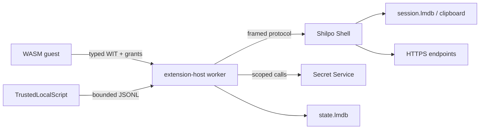

# Shilpo Extension Threat Model

> **Status**: Investigation report
> **Audited commit**: `347ff1c2b5f08e6ca1607b4115bd6b36ac6cb690`
> **Audit date**: 2026-08-14
> **Scope**: `core/ext-api`, `desktop/ext-runtime`, `desktop/services`, and `desktop/shilpo`

## Scope, assets, actors, and objectives

This report evaluates the implemented extension boundaries. It does not change policy or claim protection from an
attacker who already controls the current user's account, keyring session, kernel, or compositor.

Protected assets are Secret Service credentials; extension grants and package identity; extension state at
`state.lmdb`; clipboard and session data at `session.lmdb`; filesystem and network authority; Shell integrity and
availability; worker IPC; and trusted-script configuration, processes, output, and diagnostics.

Actors are a malformed or compromised WASM component, a malicious package/registry or publisher, corrupt persisted
data, another unprivileged local user, and a locally configured `TrustedLocalScript`. WASM components use the typed
`shilpo:extension@0.1.0` WIT boundary and capability grants. `TrustedLocalScript` is intentionally unsandboxed local
code with the current user's OS authority and is not a WASM capability.

Security objectives are least authority, extension and purpose isolation, bounded resource use, fail-closed invalid
input, safe lifecycle cleanup, and no accidental disclosure of secret bytes. Non-goals include OS-level sandboxing of
trusted scripts, physical-memory protection, and defense against equivalent user-session authority.

## Trust boundaries and data flow



| ID | Crossing | Input/format | Production control | Sensitive values |
| --- | --- | --- | --- | --- |
| XB-01 | Shell ↔ worker | 4-byte big-endian framed JSON | Protocol version and 8 MiB maximum in `desktop/ext-runtime/src/worker/process.rs:11-15,80-107` | Frames can contain effects; secret bytes must not enter them |
| XB-02 | WASM ↔ host | Typed WIT component ABI | Wasmtime limits configured in `desktop/ext-runtime/src/wasm.rs:918-970`; host authorization in `desktop/ext-runtime/src/wasm.rs:107-124,473-638` | Secret bytes cross only explicit secret calls |
| XB-03 | WASM ↔ OS | WASI Preview 2 | Empty context constructed at `desktop/ext-runtime/src/wasm.rs:945-958`; only approved WIT/WASI linker imports are added at `desktop/ext-runtime/src/wasm.rs:928-944` | No guest filesystem, environment, stdio, or process authority by default |
| XB-04 | Worker ↔ Secret Service | `oo7` D-Bus calls | Identity/purpose/handle attributes and broker errors at `desktop/ext-runtime/src/secrets.rs:252-388` | Secret bytes are confined to set/read calls |
| XB-05 | Worker ↔ extension state | Heed LMDB transactions | Namespaces, quotas, and tagged values at `desktop/ext-runtime/src/state.rs:42-54,338-407,566-800` | `SecretRef` is not a state value |
| XB-06 | Shell ↔ network | Authorized HTTPS GET | URL policy at `desktop/ext-runtime/src/effects.rs:10-45`; dispatch at `desktop/shilpo/src/shell/extension_http.rs:4-70` | Response bodies are returned to the extension event path |
| XB-07 | Worker ↔ trusted script | Process pipes and bounded JSONL | Discovery/validation at `desktop/ext-runtime/src/script/manifest.rs:81-179`; supervision at `desktop/ext-runtime/src/script/runner.rs:160-380` | stderr and records are bounded; scripts retain OS authority |
| XB-08 | Shell ↔ session store | Heed LMDB transactions | Permissions/open/recovery at `desktop/services/src/session_store.rs:108-321`; clipboard retention at `desktop/services/src/session_store.rs:323-440` | Clipboard text is sensitive and persisted |

## Existing control inventory

Controls are classified from production paths, not from test doubles or documentation alone.

| ID | Control | Status | Evidence |
| --- | --- | --- | --- |
| CTL-01 | Wasmtime fuel, epoch interruption, memory/table limits, and 512 KiB Wasm stack | Enforced | `desktop/ext-runtime/src/wasm.rs:951-956,1232-1238` |
| CTL-02 | Empty default WASI context and restricted linker imports | Enforced | `desktop/ext-runtime/src/wasm.rs:928-958,1255-1264` |
| CTL-03 | Manifest declaration plus stored/live grant authorization | Enforced | `desktop/ext-runtime/src/adapter.rs:611-665`; `desktop/ext-runtime/src/wasm.rs:473-488` |
| CTL-04 | Secret identity/purpose/handle scoping and typed failures | Enforced | `desktop/ext-runtime/src/secrets.rs:252-388`; `desktop/ext-runtime/src/wasm.rs:527-638` |
| CTL-05 | `SecretRef` debug redaction and state exclusion | Enforced | `core/ext-api/src/manifest.rs:728-754`; `desktop/ext-runtime/src/state.rs:16-20` |
| CTL-06 | Extension state quotas, namespaces, atomic revisions, and corrupt-record failure | Enforced | `desktop/ext-runtime/src/state.rs:42-54,338-407,566-800` |
| CTL-07 | HTTPS/GET/userinfo/fragment validation and no redirects | Enforced | `desktop/ext-runtime/src/effects.rs:10-45`; `desktop/shilpo/src/shell/extension_http.rs:4-9` |
| CTL-08 | HTTP response body maximum | Absent | `desktop/shilpo/src/shell/extension_http.rs:41-61` calls `response.text().await` without a byte bound |
| CTL-09 | Script path validation, process-group termination, subreaper, and output bounds | Enforced | `desktop/ext-runtime/src/script/manifest.rs:81-179`; `desktop/ext-runtime/src/script/runner.rs:341-380`; `desktop/ext-runtime/src/script/record.rs:34-165` |
| CTL-10 | Package signature/publisher checks, archive path checks, and staged capability expansion | Enforced | `desktop/ext-runtime/src/catalog.rs:1618-1710,1996-2090` |
| CTL-11 | Private session-store permissions and bounded atomic clipboard retention | Enforced | `desktop/services/src/session_store.rs:108-181,323-383` |
| CTL-12 | Host secret buffers are wiped on drop | Absent | `desktop/ext-runtime/src/secrets.rs:300-325` returns `Vec<u8>` |
| CTL-13 | HTTP DNS/private-network egress policy | Partially enforced | URL syntax is checked at `desktop/ext-runtime/src/effects.rs:10-45`, but DNS rebinding/private ranges are not filtered |
| CTL-14 | Per-extension action/notification rate limit | Absent | No production limiter was found in the authorization/dispatch path |
| CTL-15 | Source-pinned installation provenance, source ID reservation, and cross-source update/conflict isolation | Enforced | `desktop/ext-runtime/src/catalog.rs:670-687,767-880,1104-1215,1434-1485` |
| CTL-16 | Per-extension official trust requiring build-time pinned source root key AND signed release official signal | Enforced | `core/registry-contract/src/lib.rs:77-93,136-155`, `core/ext-api/src/manifest.rs:490-545`, `desktop/ext-runtime/src/catalog.rs:1607-1615` |
| CTL-17 | Rejection of non-WASM / trusted local script bundles from registry and package installation paths | Enforced | `desktop/ext-runtime/src/catalog.rs:908-928`; `desktop/ext-runtime/src/lint.rs:356-365`; `desktop/ext-runtime/src/wasm.rs:180-240` |

## Threat analysis

### WASM, capabilities, and host effects

Typed WIT removes the former JSON-over-string and generic `process:exec` boundary; the absence of `process`/`exec` in
`core/ext-api/wit/extension.wit`, `core/ext-api/src/manifest.rs`, and `core/ext-api/src/effects.rs` is a regression
property. Host effects require declaration and grant intersection. Review remaining risks around filesystem path
semantics, HTTP DNS resolution/private addresses, redirects, response size, action confused-deputy behavior, and
event/notification volume. `WasiCtxBuilder::new().build()` is created at
`desktop/ext-runtime/src/wasm.rs:958`; it does not by itself prove that every future linker import remains harmless.

Wasmtime resource limits are real production controls, but the runtime version is the workspace's current Wasmtime 47,
not an older v29 release. Guest linear-memory copies may retain secret bytes until guest memory is reused; this is a
residual property of the ABI, not equivalent to host buffer handling.

### Worker IPC and package lifecycle

`read_frame` rejects zero-length and over-8 MiB frames before allocating at
`desktop/ext-runtime/src/worker/process.rs:80-96`; therefore there is no unbounded header-allocation finding. Residual
risks are bounded memory pressure, malformed JSON, generation confusion, and restart/cleanup behavior. Package
signature, publisher continuity, archive traversal, rollback, partial update, and capability-expansion paths require
continued regression coverage; supply-chain process and auditing belong to #121.

Against a malicious registry or publisher attempting cross-source takeover or shadowing, Shilpo enforces source-pinned
installation provenance (CTL-15). Each installation receipt pins the `source_id`, the source root public key, and the
package signer fingerprint. `resolve_updates()` only considers releases matching both the pinned source identity and
publisher continuity; higher versions published by other sources are rejected as publisher conflicts. Discovering multiple
sources offering the same `ExtensionId` flags a conflict rather than silently selecting the highest version. Registry
source registration refuses duplicate source IDs to preserve cached verified indexes, and explicit source switching resets
grants and purges credentials when publisher keys differ.

To prevent third-party or community extensions hosted in the single unified registry repo (`shilpo-rs/extensions`) from
inheriting official status, official trust is enforced per-extension (CTL-16). `trust_for_release()` strictly requires
`source.is_pinned_official() && release.official`. `source.is_pinned_official()` verifies against the Ed25519 root public key
compiled into the Shilpo binary (`OFFICIAL_ROOT_PUBLIC_KEY` with optional `SHILPO_OFFICIAL_EXTENSIONS_ROOT_KEY` override), ignoring user-writable `official: bool` config.
The `release.official` signal is signed into release metadata, authorized only when manifest authors match the canonical
identity (`OFFICIAL_AUTHOR = "Sayeed Ahmed<sayeed205@gmail.com>"`) and namespace ownership in `owners.toml`. Manifest authors
are strictly validated as mailbox-form identities (`Display Name <local@domain>`) at parse time.

`OFFICIAL_ROOT_PUBLIC_KEY` is the real production index-signing public key, generated via
`shilpo ext keygen`. Its private half (`INDEX_SIGNING_KEY`) and the separate
`PACKAGE_SIGNING_KEY` are held only as protected `production`-environment secrets in
`shilpo-rs/extensions`, never on disk or in this repository.

### Secrets and state

Secret Service lookup binds Shilpo, extension ID, purpose, and handle in
`desktop/ext-runtime/src/secrets.rs:267-318`. Live grant checks occur at
`desktop/ext-runtime/src/wasm.rs:473-488`; `read`, `set`, and `delete` map typed failures at
`desktop/ext-runtime/src/wasm.rs:527-638`. Host copies returned by `item.secret().await` become an ordinary
`Vec<u8>` at `desktop/ext-runtime/src/secrets.rs:322-325`; no complete wipe-on-drop guarantee exists. Secret handles
are redacted by `SecretRef`'s formatter, and ordinary extension state intentionally has no credential variant.

Extension state is namespaced and quota-enforced, but filesystem DAC is not encryption. Session/clipboard LMDB is also
plaintext under private Unix permissions; bounded retention limits exposure duration but does not remove clipboard
sensitivity. Corruption quarantine preserves data for diagnostics, which is useful for recovery but increases the
number of copies requiring permission and deletion review.

### Trusted local scripts

Scripts are explicitly unsandboxed. Manifest path validation, process groups, Linux subreaper setup, bounded records,
bounded stderr, read-only ViewTree validation, and circuit-breaker behavior are implemented in the cited script seams.
The remaining trust questions are source-directory ownership/permissions, executable resolution and inherited
environment, process-tree edge cases, diagnostic sanitization, and whether the UI warning is sufficiently explicit.

Trusted local scripts have **no registry distribution path**. They are strictly local-only configurations located directly
by the user under `$XDG_CONFIG_HOME/shilpo/scripts/<bundle>/manifest.toml`. The official registry repository (`shilpo-rs/extensions`)
maintains reference scripts in `local-scripts/` strictly outside the scanned `extensions/*` root; the registry generator errors
on any non-WASM or ineligible directory (#104). As client-side defense in depth (CTL-17), `install_from_catalog()` and
`install_package_internal()` unpack candidate packages in staging and validate them strictly as WASM extensions via
`ExtensionCli::check()` (`ExtensionManifest` denies unknown tables such as `[runtime]`) and `probe_runtime()` (verifies
Wasmtime component instantiation). Any script-shaped bundle arriving through registry or package paths is rejected immediately
without executing or granting permissions. Any future distribution channel for trusted local scripts must remain entirely
distinct from the WASM extension registry and require an explicit, visibly stricter install flow.

### Diagnostics and denial of service

`SecretRef` formatting is structurally redacted, but all logs, errors, worker frames, HTTP response events, script stderr,
clipboard diagnostics, crash output, and test fixtures should be reviewed for accidental payload disclosure. Bounded
WASM state, frames, records, and clipboard entries reduce individual abuse; no general rate limit was found for action
or notification effects.

## Risk register

| ID | Risk and boundary | Evidence | Existing mitigation / residual exposure | Likelihood | Impact | Confidence | Treatment | Effort | Dependencies |
| --- | --- | --- | --- | --- | --- | --- | --- | --- | --- | --- | --- |
| EXT-SEC-001 | HTTP response buffering can exhaust Shell memory (XB-06) | `desktop/shilpo/src/shell/extension_http.rs:41-61` | 15-second timeout and no redirects; body has no byte bound | Medium | High | High | Mitigate | S | Add bounded streaming before broader HTTP policy work |
| EXT-SEC-002 | Host secret copies are not wipe-on-drop (XB-04) | `desktop/ext-runtime/src/secrets.rs:300-325`; `desktop/ext-runtime/src/wasm.rs:566-600` | Secret Service isolation and redacted handles; `Vec<u8>` copies remain until reuse | Low | High | High | Mitigate | S/M | Define ownership points before adding a dependency |
| EXT-SEC-003 | DNS rebinding/private-address HTTP reachability (XB-06) | `desktop/ext-runtime/src/effects.rs:10-45`; `desktop/shilpo/src/shell/extension_http.rs:4-38` | HTTPS, GET, host/path grants, and no redirects; DNS/private ranges are not filtered | Low/Medium | High | Medium | Investigate then mitigate | M | Must preserve legitimate public API access and test resolution safely |
| EXT-SEC-004 | Plaintext at-rest exposure of state and clipboard (XB-05/XB-08) | `desktop/ext-runtime/src/state.rs:566-800`; `desktop/services/src/session_store.rs:108-181` | 0700/0600 DAC, quotas, and retention; disk readers with user/root authority can read contents | Low | Medium/High | High | Document and decide separately | L | Coordinate with Phase 5; do not conflate state and clipboard |
| EXT-SEC-005 | Missing per-extension action/notification rate limit (XB-02/XB-06) | Authorization path `desktop/ext-runtime/src/adapter.rs:611-665`; dispatch callers in `desktop/shilpo/src/shell/runtime/extension_host.rs:411-571` | Fuel/hostcall byte limits and circuit breaker; burst volume can still affect UX | Medium | Low/Medium | Medium | Mitigate | M | Define user-visible diagnostic and queue/drop semantics |
| EXT-SEC-006 | Trusted-script PATH/environment and source permissions rely on local trust (XB-07) | `desktop/ext-runtime/src/script/runner.rs:160-209`; `desktop/ext-runtime/src/script/manifest.rs:81-179` | Explicit unsandboxed model, canonical bundle paths, process cleanup; user-controlled source can run arbitrary OS code | Low | Low/High | High | Accept/document; harden UX if needed | S | Keep separate from WASM capability policy |
| EXT-SEC-007 | Guest memory may retain secret copies until reuse (XB-02) | `desktop/ext-runtime/src/wasm.rs:566-600` and WIT list transfer | Wasmtime memory cap and process isolation; ABI copies cannot be completely erased by host | Low | Low/Medium | Medium | Accept/document | M | Revisit only with an ABI-compatible memory-lifetime design |
| EXT-SEC-008 | Malicious registry/publisher takeover via higher-version shadowing or cross-source update spoofing | `desktop/ext-runtime/src/catalog.rs:670-687,767-880,1104-1215,1434-1485` | Source-pinned receipts, source ID uniqueness, discovery collision detection, and zero-trust grant/secret resets on publisher switch (CTL-15) | Low | High | High | Mitigate (Enforced) | S | Preserves single global ExtensionId while isolating provenance |
| EXT-SEC-009 | Third-party extension claiming official trust status on unified or custom registry | `core/registry-contract/src/lib.rs:77-93`, `desktop/ext-runtime/src/catalog.rs:1607-1615` | Per-extension official trust signal requiring build-time compiled root key AND signed release official signal, with mailbox-form author validation (CTL-16) | Low | High | High | Mitigate (Enforced) | S | Decouples registry transport from individual extension trust |
| EXT-SEC-010 | Unsandboxed script bundle distributed or installed through WASM extension registry/package path | `desktop/ext-runtime/src/catalog.rs:908-928`; `desktop/ext-runtime/src/lint.rs:356-365` | Registry source layout separation (`local-scripts/`), generator-side WASM eligibility enforcement (#104), and client-side manifest/probe verification in `install_from_catalog` (CTL-17) | Low | High | High | Mitigate (Enforced) | S | Ensures unsandboxed scripts cannot ride one-click WASM install path |

## At-rest decisions

Extension state and Shell session data are separate decisions. `state.lmdb` is non-credential typed data with quotas and
must not be described as encrypted. `session.lmdb` includes clipboard text and therefore has higher confidentiality
concern even with a 100-entry bound and private permissions. Secret Service protection is backend-managed; this report
does not assert a specific cipher or keyring implementation detail without an independent backend guarantee.

| Option | Extension state | Clipboard/session data | Trade-off |
| --- | --- | --- | --- |
| Private LMDB + minimization | Current baseline; reasonable for non-credential state | Current baseline but retention/sensitivity should be revisited | Lowest migration risk; protects against other DAC users, not disk readers or same-user compromise |
| Value encryption with Secret Service key | Consider only for a documented threat requiring it | Consider only after deciding locked-session and recovery behavior | Adds key availability, crash, backup, migration, and test complexity |
| Storage technology change | Not justified by this investigation | Not justified by this investigation | Technology alone does not solve key management or live-session exposure |
| Disable/limit sensitive persistence | Recommended for especially sensitive clipboard classes if detectable safely | Strongest minimization, but changes user expectations | Must specify UX, recovery, and compatibility before implementation |

Recommendation: keep extension state non-credential and DAC-protected; use Secret Service for credentials. Treat clipboard
retention as a separate product/security decision, prioritizing minimization and explicit clearing before considering
application-level encryption.

## Memory and diagnostic hygiene

The host receives `Vec<u8>` from Secret Service and passes a WIT `list<u8>` to the guest. A future mitigation may use a
zeroizing owner at the broker-to-host boundary, but it cannot guarantee erasure of copies in D-Bus, Wasmtime canonical
ABI buffers, or guest linear memory. Review logs and diagnostics structurally: secret bytes, handles, clipboard text,
HTTP bodies, state values, script stderr, worker frames, and crash reports must not be formatted into production logs.

## Prioritized follow-up map

| Priority | Recommendation | Roadmap ownership |
| --- | --- | --- |
| P0 | Bound HTTP response bodies and add regression tests | Phase 2 hardening follow-up |
| P1 | Define host secret-buffer ownership and wipe behavior | Phase 5 security hardening implementation |
| P1 | Investigate safe DNS/private-network egress policy | Phase 5 security hardening implementation |
| P2 | Add effect rate limits with diagnostics and deterministic tests | Phase 5 security hardening implementation |
| P2 | Decide clipboard minimization/retention policy | Phase 3 clipboard work (#126) plus Phase 5 security review |
| P3 | Review trusted-script source permissions and trust labeling | Phase 5 hardening; remains separate from WASM policy |
| — | Publisher/signing, dependency audit, SBOM, and supply-chain process | Existing #121; do not duplicate here |

Each recommendation requires a separate ticket with named production seams, tests, verification commands, and STOP
conditions. No follow-up issues are created by #116.

## Regression properties and verification

- `process:exec` remains absent from WIT, manifest capabilities, host operations, linker policy, and WASM runtime paths.
- WASM guests and `TrustedLocalScript` remain distinct runtime kinds with distinct authority.
- Secret bytes and handles do not enter ordinary state, worker JSON, effects, or diagnostics.
- Every citation above is repository-relative and resolves at the audited commit.

The investigation was checked with:

```bash
rtk git diff --check
rtk cargo nextest run -p shilpo-ext-api -p shilpo-ext-runtime -p shilpo-services
rtk cargo clippy -p shilpo-ext-api -p shilpo-ext-runtime -p shilpo-services --all-targets -- -D warnings
```

The Cargo commands validate the audited baseline; they do not authorize unrelated fixes.
